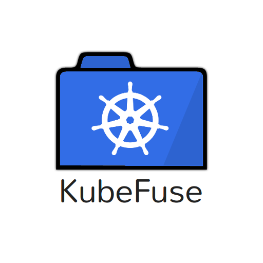

KubeFuse
========



Kubernetes as a Filesystem


## Why?

Because kubectl is great, but sometimes a bit slow to navigate.

Enter KubeFuse.

Beta quality software for quick Kubernetes browsing and editing. What's not to love.

## Features

* Browse Kubernetes resources in your file system...
* ...with (some of) your favourite tools: `ls`, `find`, `cat`, `vim`, ...
* List all your favourite resources such as: services, replication controllers, pods and namespaces
* Access resource descriptions as files (eg. `cat ~/kubernetes/default/pod/postgres-aazm1/describe`)
* Quickly read resources as YAML or JSON (eg. `cat ~/kubernetes/default/pod/postgres-aazm1/json`)
* Edit resources with your editor of choice and have Kubernetes update on writes (`vim ~/kubernetes/default/rc/postgres/json` :raising_hand:)

## Requirements

KubeFuse runs on both Linux and Mac, but does require additional libraries to be installed (eg. OSXFUSE).

KubeFuse also uses the kubectl binary under the hood so this needs to be on the path. 

## Setup and Usage

### Getting the latest release

You should be able to:

```
pip install kubefuse
```

After which the kubefuse command will be installed into a `bin/` directory that
is hopefully already on your path (if not look for the line starting with
`Installing kubefuse script to ....` and add that directory to your PATH and
restart your shell). 

You should then be able to run:

```
kubefuse [MOUNTPOINT]
```

### From Source

When "building" from source:

```
pip install -r requirements.txt
```

Will install all the dependencies (on fresh systems you may need to
`easy_install pip` first). After which you can run KubeFuse with:

```
python kubefuse/kubefuse.py [MOUNTPOINT] 
```


## Tests 

KubeFuse is extensively tested using a tool called
[Myna](https://github.com/SpectoLabs/myna).  It also uses the `nose` framework
to discover and orchestrate the tests. To run the tests install Myna and then:

```
make test
```

Examples
========

Create the mount:

```
python kubefuse.py ~/kubernetes
```

List all pods in the default namespace:

```
ls ~/kubernetes/default/pod/
```

List all known objects in the default namespace:

```
find ~/kubernetes/default -type d -mindepth 2
```

Describe the `postgres` pod:

```
cat ~/kubernetes/default/pod/postgres-aazm1/describe
```

Get logs from a `graphite` pod:

```
cat ~/kubernetes/default/pod/graphite-i3bb2/logs
```

Export the `postgres` replication controller to YAML:

```
cat ~/kubernetes/default/rc/postgres/yaml
```

Export the `postgres` replication controller to JSON:

```
cat ~/kubernetes/default/rc/postgres/json
```

Export all service definitions in the default namespace:

```
find ~/kubernetes/default/svc -name yaml | while read line ; do cat $line ; echo "----" ; echo ; done
```

We can edit replication controllers and other resources in our editor. Saving the file will replace the resource in kubernetes:

```
vim ~/kubernetes/default/rc/postgres/json
```

## License

Apache License version 2.0 [See LICENSE for details](./blob/master/LICENSE).

(c) [OpenCredo](https://opencredo.com) 2016.

